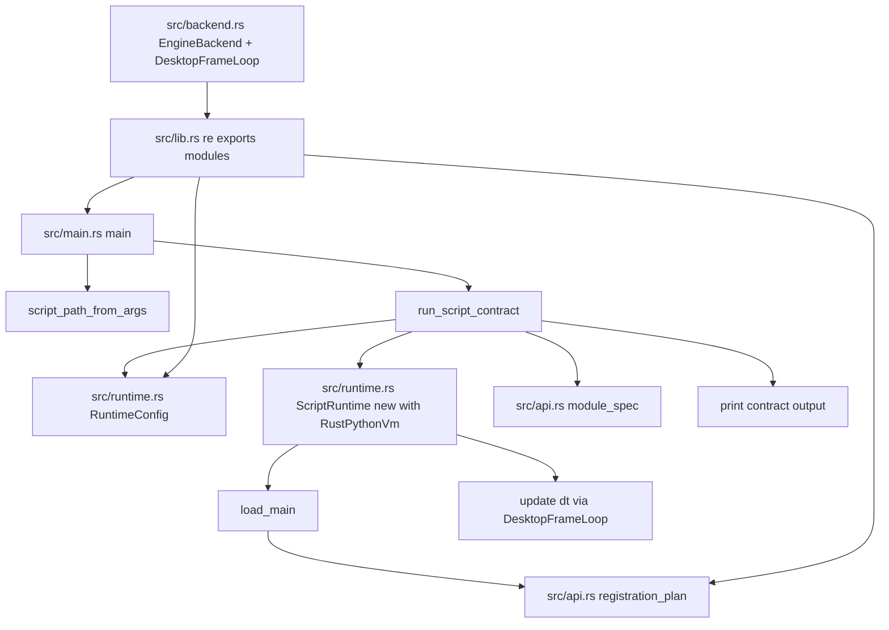
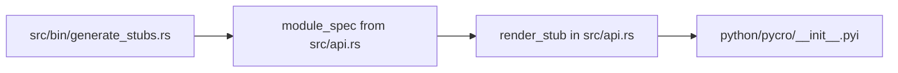
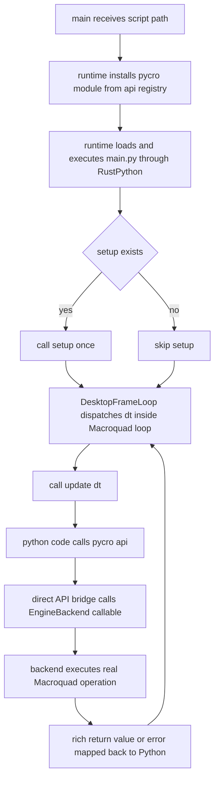
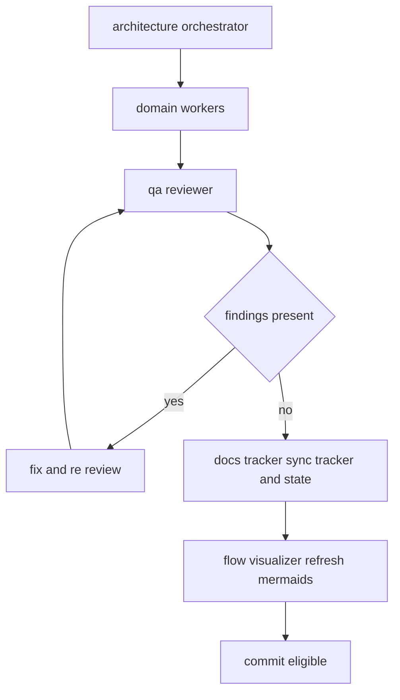

# Flow Mermaids

This document is maintained by `flow-visualizer`. It is the fast-read visual reference for runtime lifecycle and API dispatch.

## Src Module Traversal (Current Code)

## Stub Generation Traversal (Current Code)

## Runtime Lifecycle (Phase 2 Active: Direct API Bridge)

## Delivery Flow (Current Governance)

